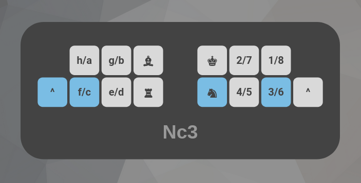

# LiBoard


LiBoard is a custom layout for playing on lichess using the keyboard input. The idea is to minimize hand movement for an ergonomic online chess experience.

## How to use
This is a chorded layout, meaning you press multiple keys at the same time to output one move. 

### Regular moves
The indexes are responsible for the pieces. For the queen, use rook + knight. For pawns, you press nothing.

The rest of the left hand is responsible for the file. Pressing the left pinky key uses the second set of letters, and not pressing it uses the first set of letters. You can think of the left pinky key as meaning "queenside", and not pressing it gives you kingside files.

The rest of the right hand is responsible for the rank. It works much the same as the files. You can think of the right pinky key as meaning black, and not pressing it gives you the white ranks. 

### Castling
Kingside castling is done by pressing king + rook. Queenside castling is done by pressing king + rook + left pinky (the queenside key)

### Underpromotion
If you want to underpromote a pawn, you need to press the file that the pawn is on, 43, and then the piece you want to underpromote to. If you're playing as black, you need to press the right pinky. 

### Same square
Sometimes two of the same piece will be controlling one square. In these cases you'll need to type two chords. First press the piece + either the rank or file, then for your second chord press the location of the controlled square. 

### Undo
If you make a mistake, backspace is mapped to fe43

## Installation
You'll need to install [kanata](https://github.com/jtroo/kanata), then download the [liboard.kbd](liboard.kbd) file from this repo. Put both kanata and liboard into the same folder, cd into that folder, and run the following command:

```
$ sudo kanata -c liboard.kbd`
```

If you don't want to use sudo, see [here](https://github.com/jtroo/kanata/wiki/Avoid-using-sudo-on-Linux).

Closing the terminal will exit kanata and restore your keyboard to its default state. You can [set up a systemd process](https://github.com/jtroo/kanata/discussions/130) to make it permanent.

## A note on lichess rules
According to [lichess rules](https://lichess.org/page/fair-play), it is prohibited to use "any program or browser extension that assists with playing moves". This rule is fairly broad, and could be interpreted to apply to custom keyboard layouts as well. 

Ultimately, the purpose of this custom keyboard is to improve the ergonomics of playing chess online. For many people, using a mouse is not possible, and having a keyboard that reduces movement as much as possible makes online chess more accessible for people who otherwise could not play. However, because lichess rules are open to interpretation, please keep in mind that the use of this keyboard may not be allowed. Use your own judgement.

## Examples




